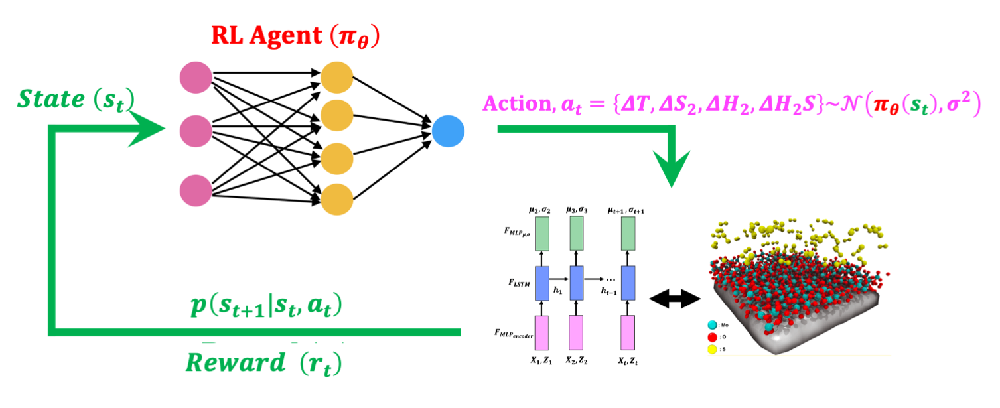

# Autonomous Reinforcement Learning Agent for CVD Synthesis of Quantum Materials
[P. Rajak,A. Krishnamoorthy *et al.*, Autonomous Reinforcement Learning Agent for CVD Synthesis of Quantum Materials](https://journals.aps.org/prb/abstract/10.1103/PhysRevB.100.014108)  
<a target="_blank" href="https://ml4physicalsciences.github.io/2020/files/NeurIPS_ML4PS_2020_123.pdf"> Quantum Material Synthesis by 
				Reinforcement Learning</a> , <a target="_blank" href="https://ml4physicalsciences.github.io/2020/">
				 NeurIPS workshop, Machine Learning and the Physical Sciences</a>.

